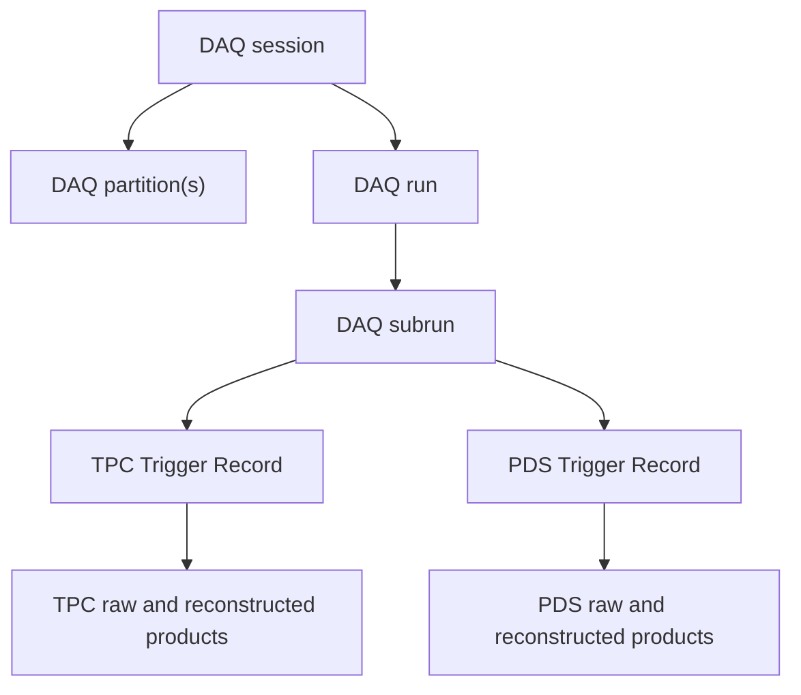
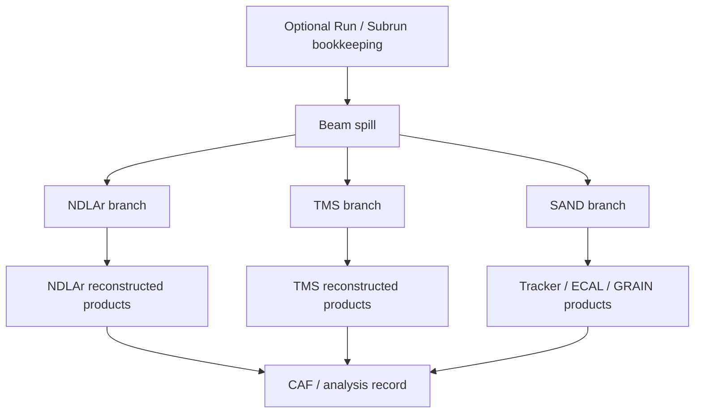
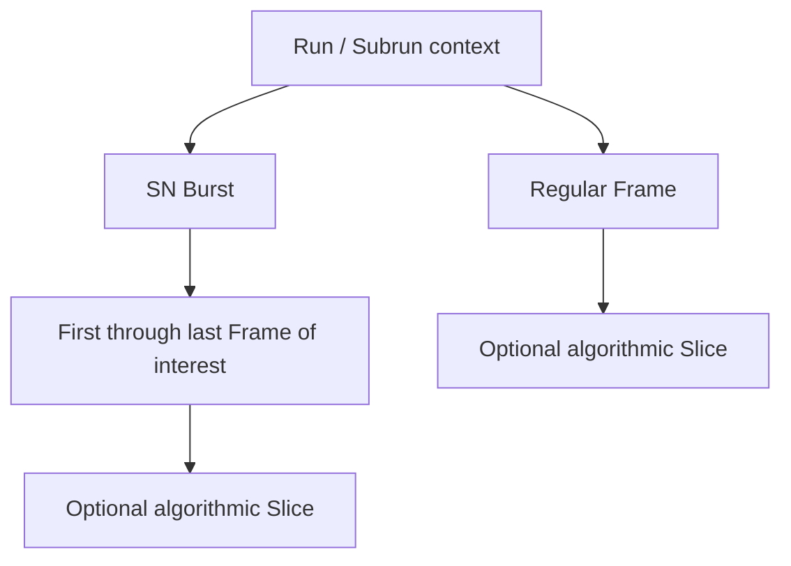
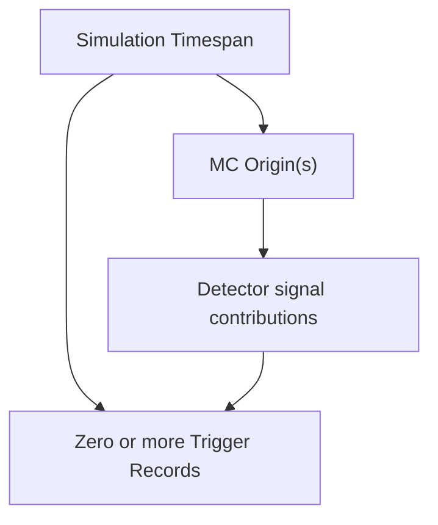

# Candidate Phlex-era hierarchy patterns

Status: working synthesis, not a ratified DUNE data model. Last verified: 2026-08-26.

The six workflow presentations share bookkeeping, bounded processing units, detector branches, and relationships between products. Their proposed topologies and terminology differ, and some choices remain unaddressed.

The six pages are also workflow presentation scopes rather than six independent detector subsystems. FD TPC and FD PDS are companion views of one production chain; ND prototypes and full ND reuse parts of the same hierarchy; protoDUNE and SAND begin from different operational assumptions. The mappings below are therefore marked as direct evidence, inherited context, inference, or unaddressed.

## Evidence labels

| Label | Meaning |
|---|---|
| **Explicit** | Stated directly in that workflow's source presentation |
| **Inherited** | Supplied by a companion presentation covering the same chain |
| **Inferred** | Cross-source synthesis that needs owner validation |
| **Unaddressed** | The source does not establish a position |

## Recurring roles

The sources use these roles; whether each needs a framework data layer remains open:

- **Operational scope**: DAQ session, partition, run, and subrun.
- **Bounded processing unit**: Trigger Record, Spill, Event, Frame, or Time slice.
- **Detector or readout branch**: APA, TPC/PDS, NDLAr/TMS, or Tracker/ECAL/GRAIN.
- **Algorithmic structure**: Reco1/Reco2 products, interactions, particles, tracks, showers, flashes, and slices.
- **Relationships**: product lineage, matching, reference reuse, and persistent navigation.

Calling Trigger Record, Spill, Event, and Frame the same layer would erase distinctions the sources rely on. Phlex allows experiment-defined layer names, so the immediate design task is to test a small set of representative topologies, not to choose one neutral word prematurely.

## Pattern 1: DAQ data and normal-trigger processing

Calcutt's protoDUNE source distinguishes a session from its partitions. A session contains several partitions and produces its own run/subrun sequence; concurrent sessions can therefore produce independent run sequences. TPC and PDS can have different Trigger Record windows.

This is a candidate data-taking topology, not a claim that every offline workflow must adopt DAQ Subrun. Calcutt says Subrun probably applies to calibration state; the source does not record a ratified offline decision.

## Pattern 2: beam-spill simulation and reconstruction

The ND workflow presentations use Spill as the natural shared upstream unit, then branch into detector-specific processing. SAND currently starts from Spill and does not use Run in simulation; Run/Subrun above Spill is therefore explicit for ND prototypes and ND-LAr/TMS, but only tolerated or inferred for SAND.

The arrows into CAF show dataflow, not a claim that CAF is a child data layer. Cross-detector matching and persisted relationships are separate requirements discussed below.

## Pattern 3: extended readout

Chappell proposes Frame as a regular window, with an SN Burst layer above a sequence of Frames and an optional Slice below a window. This is an FD-TPC proposal that still needs validation against FD-PDS and protoDUNE extended-readout cases.

Whether Frame, Trigger Record, and Spill are separate layers, alternate configurations, or mappings of one framework concept remains a design question.

## Pattern 4: simulation Timespan and Origins

Calcutt explicitly says simulation and data need different structures. The highest simulation unit is a Timespan containing MC Origins such as GENIE interactions and radiological decays. Signals from one simulated particle can contribute to multiple Trigger Records and, in the general DAQ-partition case, cross run boundaries.

An executable simulation example needs to test these cross-window and cross-run relationships.

## Mapping the workflow presentations

| Workflow scope | Bookkeeping | Bounded processing unit | Main branches | Evidence note |
|---|---|---|---|---|
| protoDUNE | Session, partition, Run, candidate Subrun | Distinct TPC and PDS Trigger Records | TPC and PDS | **Explicit** for data; separate Timespan/Origins structure **explicit** for simulation |
| ND prototypes | Run and Subrun | Spill for charge, Trigger for raw light, Event at Reco2 | Charge and light | **Explicit**; the units change across stages rather than forming one fixed tree |
| ND-LAr and TMS | Run and Subrun | Spill | NDLAr and TMS | **Explicit**; final cross-detector match is unresolved in the source diagram |
| SAND | Run liked but unused; Subrun tolerated | Spill, then Time slice | Tracker, ECAL, GRAIN | **Explicit** from Spill downward; upper bookkeeping is not current practice |
| FD TPC | Run and Subrun | Spill baseline; proposed Frame/SN Burst/Slice extensions | APA and reconstruction products | Baseline and extensions **explicit proposals**, not adopted structure |
| FD PDS | Companion FD chain | Event-level, per-channel and per-time-slice products | Optical detector products | FD bookkeeping **inherited** from the companion TPC talk; no independent hierarchy proposal |

## Association requirements

Four workflow presentations surface association-related needs, but they occur at different stages and require different semantics:

| Workflow scope | Example | Requirement class |
|---|---|---|
| ND prototypes | Repeated `ndlar-flow` reference datasets | Reference representation and duplication |
| ND-LAr and TMS | TMS-to-NDLAr matching at CAF production | Cross-detector matching |
| FD TPC | `PointCharge` and `SpacePoint` co-indexing; same-type relationship limitation | Explicit identity and same-type associations |
| FD PDS | Waveform to Hit to Flash links are expected but missing | Product lineage and navigation |

Phlex's Window higher-order function schedules work over adjacent data cells. It may help an algorithm examine neighboring cells, but it does not by itself define arbitrary within-cell relationships or their persistence. Cross-layer access is likewise an execution pattern, not an `art::Assns` replacement.

The design requirement is for references or associations that can be represented as first-class data products and persisted through FORM. See [I/O, persistence, and associations](io-persistence.md) for the resulting requirement taxonomy and candidate table representation.

## Decisions and tests still needed

1. Select representative **data**, **beam simulation**, and **extended-readout** topologies for executable examples.
2. Decide which concepts are framework data layers and which are schema-level objects or relationships.
3. Test whether Trigger Record, Spill, Event, Frame, and Time slice ever map cleanly, rather than assuming they are synonyms.
4. Validate the FD-TPC Frame/SN Burst/Slice proposal with FD-PDS and protoDUNE owners.
5. Define association tests spanning same-type, cross-detector, metadata-bearing, reverse-lookup, and persisted cases.
6. Add the missing full protoDUNE production-chain source before treating its normal-trigger path as a complete baseline.

## Sources

- Jake Calcutt, *Data Hierarchy Discussion*, Phlex Adoption WG, 2026-06-15.
- Sindhu Kumaran, *ND Prototypes Data Hierarchy*, Phlex Adoption WG, 2026-06-15.
- Charlotte Knight, *ND Sim/Reco Workflow*, Phlex Adoption WG, 2026-08-24.
- Valerio Pia, *SAND Sim/Reco Workflow*, Phlex Adoption WG, 2026-08-24.
- Andy Chappell, *TPC Workflow*, Phlex Adoption WG, 2026-08-10.
- Laura Paulucci, *FD Sim/Reco PDS Workflow*, Phlex Adoption WG, 2026-08-10.
- Brett Viren, *DUNE Data Model in the Phlex Era*, 2026-05-20.
- [Phlex design documentation](https://framework-r-d.github.io/phlex-design/).
- [Persistent references and associations design discussion](https://github.com/Framework-R-D/phlex-design/blob/main/persistent-references-and-associations.md).
