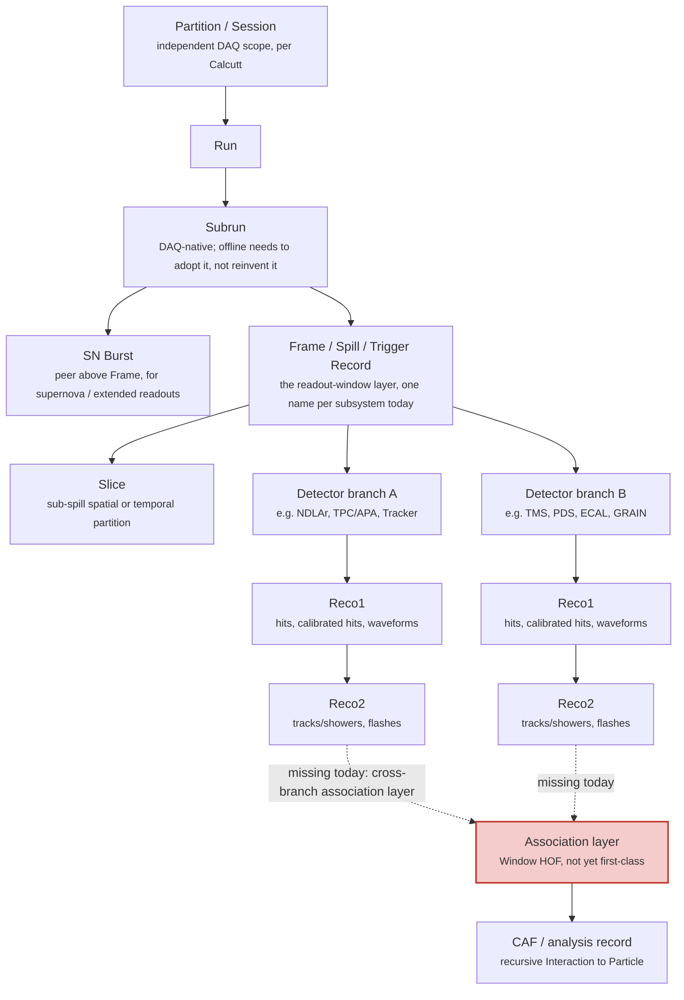

# A Phlex-era hierarchy model

This page is a synthesis, not a ratified decision. It pulls together what the six subsystem workflow decks and the June 15 2026 data-layer meeting each proposed on their own, and lays out where they agree, where they diverge, and what a single extensible hierarchy that covers all six might look like. Treat it as a starting point for discussion with the Phlex Adoption WG and framework developers, not as an adopted DUNE data model.

## What every subsystem already agrees on

Every subsystem's proposed or documented hierarchy bottoms out in the same shape: a run-scoped identifier, a readout-window identifier, and one or more detector-element branches underneath it. Nobody is proposing a fundamentally different shape. The disagreements are about naming, about where the hard cases attach, and about how far down the tree associations need to be first-class rather than ad hoc.

Two sources pin this down with the most precision:

- Jake Calcutt's protoDUNE deck establishes that a "run" is scoped per DAQ session or partition, not a single global sequence, and that TPC and PDS can have distinct Trigger Record windows inside the same run. Subrun already exists as a DAQ concept; offline software never had one.
- Andy Chappell's FD-TPC deck proposes naming the readout-window layer explicitly: a **Frame**, peer to Spill, with an **SN Burst** layer above it for supernova-scale readouts and a possible **Slice** layer below it for sub-spill spatial partitions.

## The layered model

The dashed edges mark the one layer that does not exist as a first-class Phlex concept yet: the point where two independently unfolded branches need to be stitched back together. Every subsystem hits this in its own way. Right now every subsystem solves it with hand-written glue code inside its own CAFmaker or equivalent, five separate implementations of the same missing layer.

## Reading the model against each subsystem

| Layer | protoDUNE | ND prototypes | ND-LAr+TMS | SAND | FD-TPC | FD-PDS |
|---|---|---|---|---|---|---|
| Partition / Session | DAQ-defined, explicit in Calcutt's deck | Not addressed in the 4-slide deck | Not addressed directly | Not addressed directly | Implicit in DAQ partitioning (Chappell) | Not addressed directly |
| Run / Subrun | DAQ-native run; DAQ already defines subrun, offline doesn't yet | Run, Subrun used directly | Run, Subrun used directly | Run "liked but not used yet" (Pia) | Run, Subrun, baseline | Follows the FD-TPC baseline |
| Readout window | Trigger Record (TPC and PDS have distinct windows) | Spill / Trigger | Spill | Spill, "where real work starts" (Pia) | Proposed Frame layer, peer to Spill | Event-level, per-time-slice |
| Extended readout | Not addressed | Not addressed | Not addressed | Not addressed | Proposed SN Burst layer | Shares FD-TPC's need, not separately addressed |
| Detector branches | TPC and PDS as separate raw-to-Reco1 chains | Q and L (charge/light) as separate branches at every stage | NDLAr and TMS unfold fully independently | Tracker, ECAL, GRAIN as independent branches from v1.2 onward | APA-level, HD and VD share producers | Per-channel, 6000 in FD-HD, 672 in FD-VD 10kt |
| Reco1 / Reco2 | Wire→Hit→Cluster→...; OpWaveform→OpHit→OpFlash | Q: raw hit→calib hit; L: waveform→flash | tms-reco, larnd-sim→ndlar-flow, SPINE/Pandora | ufw-based SANDRECO, no LArSoft | gaushit/spsolve/hitfd→Pandora+calo/PID/CVN | ophit→opflash/opslicer/flashmatch |
| Association layer | Not addressed in-deck | `ndlar_flow` reference-dataset duplication flagged, unresolved | TMS↔NDLAr "unsure" stitch, the clearest named example | Not addressed directly | `PointCharge`↔`SpacePoint` not `Assn`-linked | `OpDetWaveforms`→`OpHit`→`OpFlash` "should exist but it is not there" |

## What this suggests, not what it decides

A hierarchy that could serve all six without forcing any of them into a shape they don't fit would need three things none of them individually asked for by name, but that fall out of laying them side by side:

1. **The readout-window layer needs a name that isn't already claimed by a specific subsystem's vocabulary.** "Spill" means something specific in ND-Sim/Reco language; "Trigger Record" means something specific in DAQ language; "Frame" is Chappell's proposed neutral term. Picking one consistently, rather than letting five subsystems each keep their own word for the same conceptual layer, is a naming decision more than a design decision, but it's the kind of thing that becomes expensive to fix later if left ambiguous now.
2. **Extended-readout layers (SN Burst) and sub-window layers (Slice) should be optional, not mandatory, tree extensions.** protoDUNE and most of ND don't need them today. FD-TPC and FD-PDS's long-readout cases do. Kirby's stated principle, don't chase one event data model to rule them all, applies exactly here: the baseline should be the short-readout case, with SN Burst and Slice as opt-in extensions rather than always-present layers everyone has to reason about.
3. **The association layer is the one piece that can't be left to five separate ad hoc implementations without cost.** Four subsystems have independently hit the same missing piece (ND-LAr+TMS, FD-TPC, FD-PDS, ND prototypes). A single Phlex-native cross-branch association mechanism, built once against Window HOF semantics, would replace five hand-rolled versions of the same problem.

None of this is a Phlex framework commitment. It's a reading of what five independently-written decks converge on when placed next to each other, offered as a starting point for the WG's own design discussion, not a substitute for it.

## Sources

- protoDUNE: Jake Calcutt, Phlex Adoption WG, 2026-06-15
- ND prototypes: Sindhu Kumaran, Phlex Adoption WG, 2026-06-15
- ND-LAr+TMS: Charlotte Knight, Phlex Adoption WG, 2026-08-24
- SAND: Valerio Pia, Phlex Adoption WG, 2026-08-24
- FD-TPC: Andy Chappell, Phlex Adoption WG, 2026-08-10
- FD-PDS: Laura Paulucci, Phlex Adoption WG, 2026-08-10
- Baseline hierarchy principle: Mike Kirby, June 15 2026 data-layer meeting
- Candidate hierarchy formats: Brett Viren, DUNE data model note, 2026-05-20
