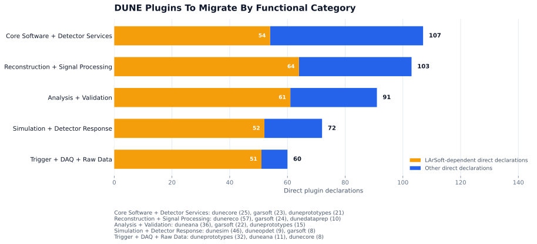
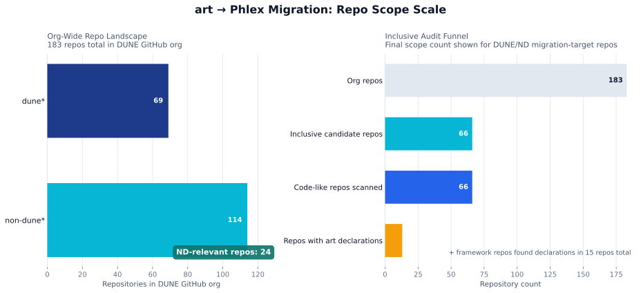

# Milestones and migration scope

This page records program milestones, the June 2026 benchmark plan, and an April 2026 migration-scope estimate. Current completion status needs an owner-reviewed update.

Last verified: 2026-08-26.

## Milestone schedule (August 2026 record)

| Milestone | Target | Recorded status or scope |
|---|---|---|
| F1: Prototype | December 2025 | Done, reached December 22, 2025, on schedule. |
| F2: Integration | September 2026 | Target: integrated system capable of simple workflows, including I/O; completion not recorded here. |
| F3: Workflow | 2027 | Not yet reached. |
| F4: FD full feature | 2028 | Not yet reached. |
| F5: FD consolidation | 2029 | Not yet reached. |
| F6: ND full feature | 2030 | Not yet reached. |
| F7: ND consolidation | 2031 | Not yet reached. |

The F1 prototype passed an external Conceptual Design Review (CDR) in October 2025 with a strongly positive verdict: reviewers cited "clear advantages over existing frameworks," with risks judged "acceptable and mitigable." The prototype was tested on multiple platforms, has Python examples available, and its own documentation was described by reviewers as excellent.

## Last documented F2 benchmark plan

The June 2026 DPC preparation material recorded the following benchmark state. The table records that checkpoint; later progress is not documented here:

| Benchmark | June 2026 checkpoint |
|---|---|
| Multi-platform install and onboarding | Enabled against Phlex 0.1/0.2 |
| Python providers for basic product types | Enabled against Phlex 0.2 |
| Multi-layer data access | Enabled against Phlex 0.2 |
| C++23 build on target platforms | Enabled against Phlex 0.2 |
| FORM I/O round-trip | Planned for F2 |
| End-to-end simple FD workflow | Planned for F2 |
| First migrated algorithm in a Phlex workflow | Planned for F2 |
| Phlex environment in the `dunesw` release ecosystem | Planned for F2 |
| CI validation for Phlex-based repositories | Planned for F2 |

An owner-reviewed update is required before using this as the current F2 report.

## Migration scope baseline: 2026-04-09

The 2026-04-09 scan counted `art`/LArSoft plugin declarations across DUNE repositories to estimate migration scope. The counts describe that inventory, not migration progress. The scan inputs, repository revisions, and counting method still need a public reference.

**Direct declaration scope**: 433 direct plugin declarations across the scanned DUNE org repos.

**LArSoft dependencies**: the scan found at least one LArSoft `#include` for 282 declarations. It found none for the remaining 151. Include counts alone do not establish whether a declaration can be migrated independently.

**Indirect dependencies**: the scan also identified 794 files coupled to `art`, including configuration and support code. The combined count is 1,227 files; only 433 are direct plugin declarations.

*Direct declarations by category: core software and detector services (107), reconstruction and signal processing (103), analysis and validation (91), simulation and detector response (72), and trigger, DAQ, and raw data (60).*

*How the full DUNE-org repository scope narrows down to the subset actually carrying `art` plugin declarations.*

By DUNE area, the direct declarations break down as: Far Detector and common physics (195), protoDUNE (83, currently in `duneprototypes`), Near Detector (82, mostly `garsoft` with a smaller `dunendlar` share), and core/common code (73).

## How to migrate a module

The Phlex developers' guide, [*Migrating to Phlex*](https://framework-r-d.github.io/phlex-examples/), is the reference for moving an `art` module to Phlex. It works in three stages: separate the algorithm from `art` constructs, extract it into plain functions or classes with explicit inputs and outputs, then bind it to Phlex nodes. Its worked example is LArSoft's `GausHitFinder`, which is also the first de-artify candidate named for the FD TPC chain (see [Existing art/FHiCL workflows](existing-art-workflows.md)). The guide's source is in `migration/doc/` of [Framework-R-D/phlex-examples](https://github.com/Framework-R-D/phlex-examples).

## Execution tracking

There is no public module-by-module migration tracker yet. For current status on a specific module, repository, or F2 benchmark, ask the Phlex Adoption Working Group. A tracker link will be added here once a public view exists.

## See also

- [*Migrating to Phlex*](https://framework-r-d.github.io/phlex-examples/): the Phlex developers' art-to-Phlex migration guide
- [Repositories](repositories.md)
- [Subsystem workflows](subsystems/index.md)
- [Ecosystem: dune-xerosere](ecosystem.md)
- [Coverage and known gaps](coverage.md)
